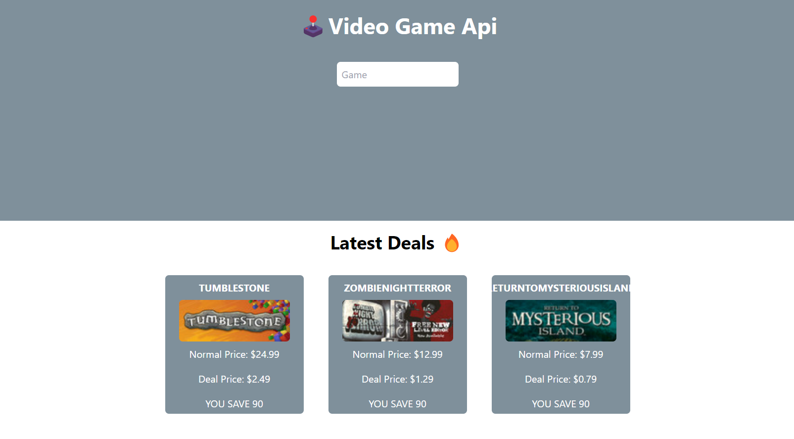
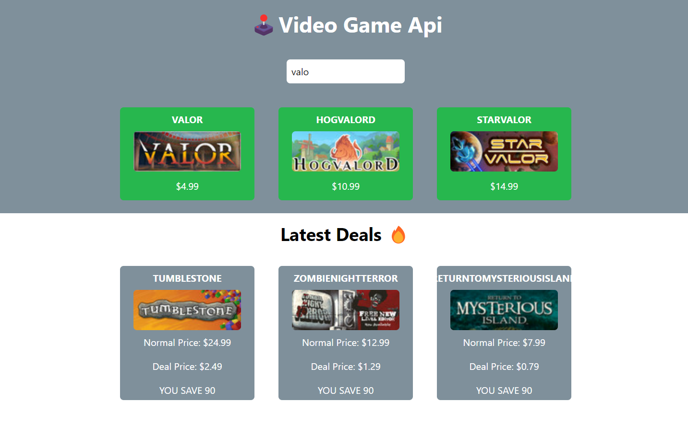
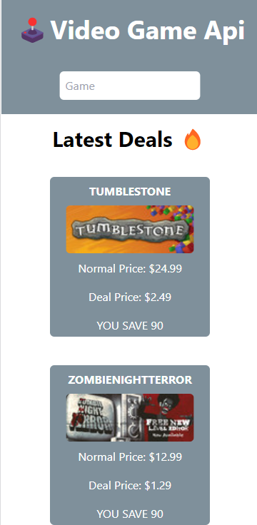

# Video Game API 

The Video Game API App is created using React and TailwindCSS. From this project, I got to learn more about the React useeffect, fetch, working with APIs and the swr library.

# Demo:

